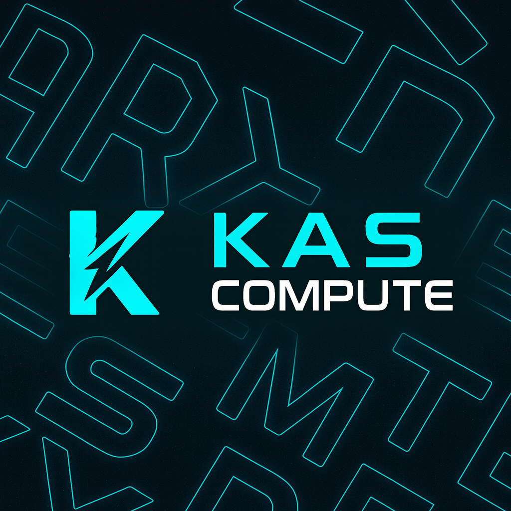

<!--
  NOTE:
  - Replace the image paths in /assets with your real files:
    - assets/kascompute-banner.png
    - assets/kascompute-demo.gif or .mp4
    - assets/kascompute-architecture.png or .gif
-->

<p align="center">
  
</p>

<p align="center">
  
</p>

<h1 align="center">⚡ KASCompute — Compute Layer Prototype on Kaspa</h1>

<p align="center">
  <strong>Live Proof-of-Compute • Real-time Nodes • Tokenomics Engine • Kaspa BlockDAG Native</strong>
</p>

<p align="center">
  <a href="https://github.com/KASCompute/kascompute-service/stargazers">
    
  </a>
  <a href="https://github.com/KASCompute/kascompute-service/issues">
    
  </a>
  
  
  
  
</p>

---

## 🧬 What is KASCompute?

**KASCompute** is a conceptual compute-layer prototype built on top of the **Kaspa ecosystem**.

It explores how a future decentralized compute marketplace on Kaspa could look:

- 🟢 **Node heartbeat system** (online presence & hardware profile)
- 🔵 **Proof-of-Compute (PoC)** submissions from CPU / GPU nodes
- 🟣 **Job grouping & workload simulation** (via `job_id`)
- 🟡 **Reward estimation engine** for a native token (KCT)
- 🧠 **Global state engine** tracking nodes, proofs, jobs, rewards & emission
- 📊 **Full KCT emission model** (14 years, 1% monthly decay)
- 💰 **Investor & treasury simulation** (DCF-style modeling)
- 📡 **Real-time dashboard** for all network metrics

> 🚫 Not a fork.  
> ✅ Fully custom-built prototype on top of Kaspa.


```md


 Kaspa Layer 1 (BlockDAG)
          │
          ▼
 KASCompute Coordinator (API Engine)
          │
   ┌──────┼────────┐
   │      │        │
Heartbeat  Jobs   PoC Validation
(Node)    work    Reward Engine
          │
          ▼
  KASCompute State Engine
          │
          ▼
 Frontend Dashboard (Real-Time UI)


[ CPU/GPU Node ]
       │  heartbeat
       ▼
[ Coordinator ]
       │  job assignment (simulated)
       ▼
[ Node executes work ]
       │  work_units
       │  submit proof
       ▼
[ PoC Validator + Reward Engine ]
       │  validate (job_id, work_units, hardware)
       │  estimate reward_kct
       ▼
[ KASCompute State Engine ]
       │  update nodes / jobs / proofs / rewards
       ▼
[ Dashboard UI ]
       • PoC feed
       • jobs table
       • rewards
       • leaderboard


💎 KCT Token Emission Model (Concept)

Total Supply: 10,000,000,000 KCT
Mining Allocation: 9,000,000,000 KCT (90%)
Treasury: 1,000,000,000 KCT (10%)

Parameters:

| Parameter     | Value                  |
| ------------- | ---------------------- |
| Start Reward  | 200 KCT per block      |
| Monthly Decay | 1% (0.99 multiplier)   |
| Duration      | ~168 months (14 years) |
| Block Time    | 1 minute               |

Reward formula:

R(m) = 200 * 0.99^(m - 1)

The dashboard visualizes:

Monthly block reward

Cumulative supply

Mining vs. treasury split

Long-term emission behavior


🖥 Live Testnet Dashboard

URL:
https://kascompute-testnet.onrender.com/dashboard/

Shows:

Active nodes & last heartbeat

Proof-of-Compute feed

Recent jobs grouped by job_id

Work units & estimated rewards

Network compute overview

Hardware detection (CPU / GPU)

Emission & reward preview

Treasury vesting curve

Investor cashflow simulation

Node leaderboard


🔌 API Endpoints (Public Prototype)

Note: endpoints and payloads may evolve as this prototype matures.

Health
GET /health

Reward Preview
POST /reward/preview
Content-Type: application/json

{
  "month": 12
}

Monthly Emission Curve
GET /emission/monthly

Investor Value Flow (Post-Mining)
GET /investor/value_flow?fee_annual=100000&investor_pct=0.1&years=10&growth=0.1&discount=0.05


🏗 Project Structure

kascompute-service/
├── src/                     # Core Rust service (local backend)
├── testnet-launcher/        # Testnet / production launcher (Render)
│   ├── src/main.rs          # Coordinator API, PoC & state engine
│   └── public/              # Live dashboard (index.html, app.js, style.css)
├── public/                  # Optional static assets (landing, misc)
├── assets/                  # Logos, banners, diagrams, animations
├── scripts/                 # Helper scripts (deployment, tools)
└── tests/                   # Test placeholders / future coverage

🔎 The live dashboard uses:
testnet-launcher/public/index.html, app.js, style.css.


🎨 Dashboard Styling (SCSS Example)
.network-panel {
  background: #050608;
  border: 2px solid #00E3C0;
  padding: 20px;
  border-radius: 16px;
  box-shadow: 0 0 24px rgba(0, 227, 192, 0.25);

  .title {
    color: #00E3C0;
    font-size: 22px;
    margin-bottom: 10px;
    font-weight: 600;
    letter-spacing: 0.04em;
  }

  .metric {
    font-size: 15px;
    color: #e5e5e5;
    margin: 4px 0;
    opacity: 0.9;
  }

  .value {
    color: #00E3C0;
    font-weight: 700;
  }
}


💻 Run Locally
Prerequisites

Rust (stable)

Cargo

Start backend
cargo run


Dashboard is available at:

http://127.0.0.1:8080/dashboard/


🚀 Deploy (Render)
Build
cargo build --release --package testnet-launcher

Start
./target/release/testnet-launcher

Live (current testnet):
https://kascompute-testnet.onrender.com/dashboard/


🧭 Roadmap
✅ Already in place

PoC engine (simulated)

Node heartbeat system

Global state engine

KCT emission model

Reward preview API

Monthly emission API

Investor value flow simulations

Treasury vesting model

Live dashboard (jobs, nodes, rewards)

Architecture diagrams (PoC, DAG-style)


🔜 Planned next

Node reputation & scoring

Real workload distribution across nodes

Multi-node scheduling & job routing

Developer SDK / client library

Whitepaper v2 integration

Extended PoC verification models


⚠️ Disclaimer

This repository is for research & development.
Nothing here is financial advice or an economic guarantee.
Parameters, models and assumptions may change as the design evolves.


📫 Contact

Website: https://kascompute.org

X / Twitter: https://x.com/KASCompute

Telegram: https://t.me/KASCompute

KASCompute Team — Founder: Tarik Kaya
Built with 💚 on Kaspa.

