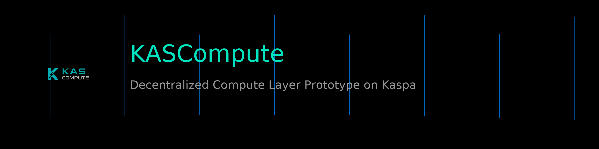

  

<h1 align="center">⚡ KASCompute — Off-Chain Compute Layer aligned for Kaspa vProgs</h1>

  <strong>Proof-of-Compute • Real-Time Nodes • Future vProgs Settlement • Kaspa BlockDAG Native</strong>

  
  
  
  
  
  

---

## 🧬 What is KASCompute?

**KASCompute** is an off-chain compute layer prototype designed to integrate with **Kaspa’s future vProgs settlement layer.**

It explores how decentralized compute could evolve around Kaspa:

- ⚙️ Node heartbeat & hardware profiles
- 📡 Job execution & workload simulation
- 🔐 Proof-of-Compute submissions
- 🧮 Reward engine (KCT emission model)
- 📊 Global state dashboard in real-time
- 🧱 Future: vProgs anchoring for trustless settlement

> **Running today:** off-chain proof validation & state tracking  
> **Goal:** settlement through vProgs once live on Kaspa  

---

## 🔒 Official Project Notice

This repository represents the **official KASCompute project**.

Official sources:
- 🌐 Website: https://kascompute.org
- 💻 GitHub: https://github.com/KASCompute
- 🖥 Dashboard: https://dashboard.kascompute.org

The **KASCompute name, branding, logo, and public communication**
are **not covered by the MIT license**.

Forks and modifications of the code are permitted under the MIT License,
but **any project presenting itself as "KASCompute" without explicit approval
is not affiliated with the official project**.

---

## ⚡ Vision Architecture (vProgs Alignment)

**Kaspa (Layer 1 - Settlement Layer)**
- Finality, Security, BlockDAG

**vProgs (Future Execution Layer)**
- ZK Verification
- Conditional Logic
- Proof Anchoring (future settlement target)

**KASCompute (Off-Chain Compute Layer - Today)**
- Proof-of-Compute (PoC)
- State & Reward Engine
- Job Scheduling / Nodes

**Compute Nodes**
- CPU/GPU Workload
- Heartbeat → Proof Submission

🔹 **Today:** Off-chain prototype  
🔹 **Future:** Settlement via vProgs on Kaspa.   

---

## 💠 KCT Emission Model (Concept)

| Parameter       | Value                |
|-----------------|----------------------|
| Supply          | 10B KCT              |
| Mining          | 9B (90%)             |
| Treasury        | 1B (10%)             |
| Start Reward    | 200 KCT / block      |
| Decay Rate      | 1% monthly           |
| Duration        | ~14 years            |

R(m) = 200 * 0.99^(m - 1)

---

## 🖥 Live Dashboard Prototype
🔗 https://dashboard.kascompute.org

- Active nodes & uptime
- Proof-of-Compute feed
- Work units & reward estimation
- Emission / treasury modeling
- Leaderboard & global metrics

> Prototype. Not mainnet. Parameters may evolve with vProgs.

---

## 🔌 API (Prototype Stage)

GET  /health POST /reward/preview GET  /emission/monthly GET  /investor/value_flow

---

## 🏗 Project Structure

kascompute-service/
- src/                          # Core Rust backend
  - coordinator.rs              # API, jobs, PoC, scheduling
  - state.rs                    # global state, nodes, rewards
  - proof.rs                    # proof-of-compute logic
- testnet-launcher/             # live test environment
  - src/main.rs                 # coordinator (Render deployment)
  - public/                     # dashboard (index/app/style)
- assets/                       # banners, diagrams, logo
- scripts/                      # deployment & tooling
- docs/                         # vProgs research & architecture notes

## 🚀 Roadmap

### 🟢 Current
- PoC engine (off-chain)
- Node heartbeat tracking
- Reward & emission model
- Real-time dashboard
- vProgs alignment phase started

### 🟡 Next
- Node scoring system
- Job routing / scheduling logic
- Draft ZK-proof structure
- Developer SDK / client lib

### 🟣 Future (vProgs Era)
- Proof anchoring → vProgs
- Settlement → Kaspa BlockDAG
- Trustless compute lifecycle

---

## ⚠️ Disclaimer
R&D prototype. Not financial advice.  
No guarantee of future economics or performance.  
Integration with vProgs depends on official release timing.

---

## 📫 Contact
🌐 https://kascompute.org  
🐦 https://x.com/KASCompute  
💬 https://t.me/KASCompute  

Founder: **Tarik Kaya**  
Built with ⚡ & 💚 on Kaspa.
